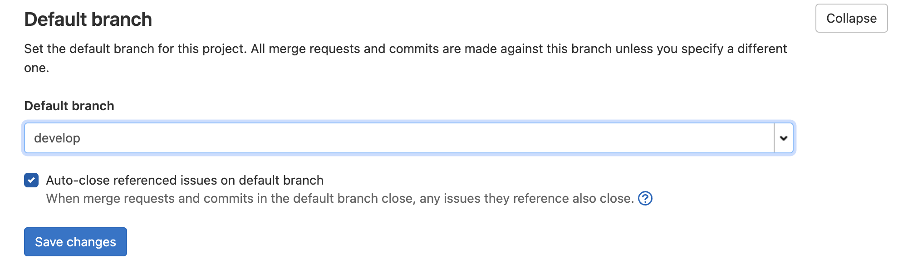
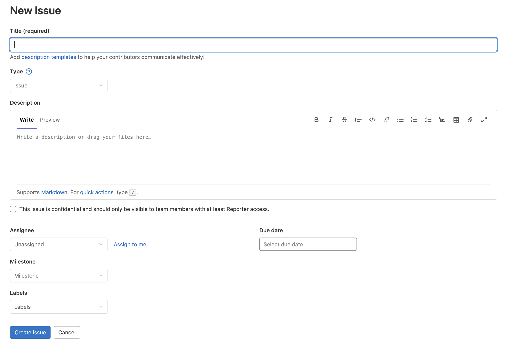

Gitlab - это современная технология, используемая для управления разработкой программного обеспечения, включая в основу систему управления репозиториями Git.
## 1. Создание личного репозитория с нужным .gitignore и простым README.MD.
Репозиторий в системах связанных с Git - директория, в которой хранится проект.
Чтобы создать репозиторий на Gitlab необходимо нажать соответствующую кнопку (Create new project).

На странице создания проекта из основных свойств задать ему можно:
 - Название
 - Описание
 - URL
 - Доступ для остальных пользователей

В репозиториях есть как минимум два вида особых файла: .gitignore && README.md
В .gitignore указываются шаблоны файлов, которые не будут добавляться в коммит.
README.md отображается на основной странице репозитория и используется для его описания.

## 2. Cоздание веток develop и master.
Ветки - разные версии проекта. Основной веткой по умолчанию является ветка master.
Создавать новые ветки можно при нажатии соответственной кнопки (New branch).

## 3. Установка ветки develop по умолчанию.
Как было сказано ранее, ветка по умолчанию - master, но это можно поменять в настройках.

## 4. Создание issue на создание текущего мануала.
В Gitlab можно создавать задачи во вкладке Issue.

В задаче надо задать максимально подробное описание, чтобы программист смог его полностью понять.
Также назначение исполнителя выбирается на этапе создания задания.
## 5. Создание ветки по issue.
Решение заданий делаются на отдельных ветках, которые потом заливаются в ветку по умолчанию.

## 6. Создание merge request по ветке в develop.
Для того чтобы залить изменения на новой ветке в основную создаются merge request.

## 7. Комментирование и принятие реквеста.
Для того чтобы merge request можно было принять, т.е. внести изменения в основную ветку, его должны подтвердить другие программисты.
Если они согласны с вносимыми изменениями то они ставят merge request'у апрув и его вливают в ветку.
Если они находят там недоработки то оставляют соответствующие комментарии об этом.
## 8. Формирование стабильной версии в master с простановкой тега.
Тэги - версии проектов, каждые из которых могут использоваться.

## 9. Работа с wiki проекта.
Wiki - отдельная вкладка в Gitlab, страницы которой могут создавать сами пользователи репозитория.
Она используется для понимания работы проекта его пользователями.
